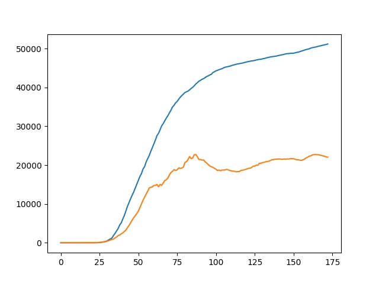
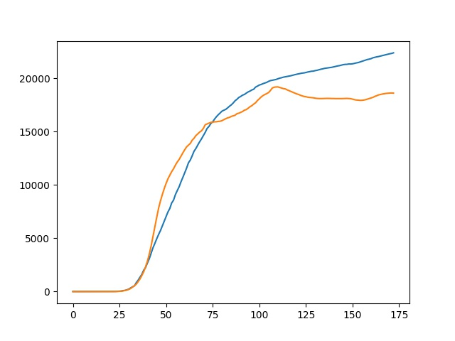
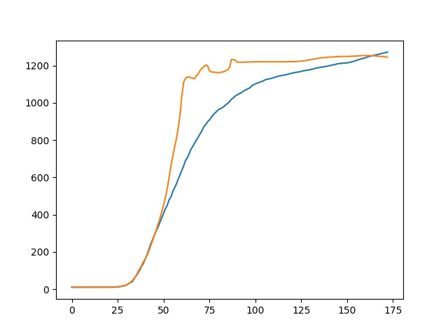

# Predict Covid-19 Confirmed

## Author

Youwei Huang

s1296394@monmouth.edu

Developed in Shanghai, China

2020/8/16

## Requirements

-   Python 3
-   sklearn
-   tensorflow
-   keras
-   matplotlib

## Data Standard

### To Train

-   Wold confirmed covid-19 data list
-   Window 30 days

### To predict

-   NJ confirmed covid-19 data list
-   Window 30 days

## Run

```
python3 train.py
```

## Example Plot







More examples refer to the directory charts!
